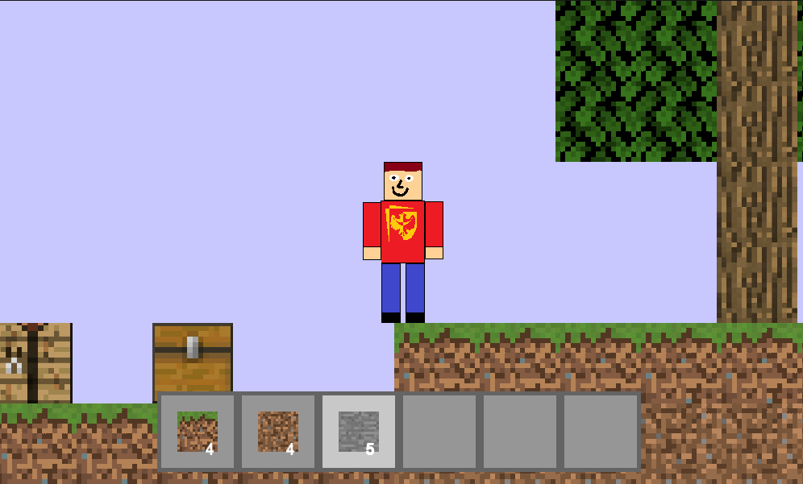

# Minecraft2D



## WARNING

NOT OFFICIAL MINECRAFT PRODUCT. NOT APPROVED BY OR ASSOCIATED WITH MOJANG.

## Table of Contents
1. [Introduction](#introduction)
2. [Features](#features)
3. [Installation](#installation)
4. [How to Play](#how-to-play)
5. [License](#license)
6. [Contact](#contact)

## Introduction
It is a sandbox game where you can wonder around the world and break and build blocks

## Features
- 2D World 30 blocks wide and 15 blocks high
- 7 different blocks each with different break time
- Equipment that can hold up to 6 types of blocks

## Installation
Follow these steps to set up and run the Game on your local machine:

1. **Clone the repository**
    ```bash
    git clone https://github.com/mmajews4/Minecraft2D
    ```

2. **Navigate to the project directory**
    ```bash
    cd Minecraft2D
    ```

3. **Install sfml if you don't already have it**
    Depending on your operating system instalation process may vary, feel free to chech it out yourself.
    If you're useing Ubuntu or Debain, open terminal and write down these comands:
    ```bash
    sudo apt update
    sudo apt install libsfml-dev

    ```

4. **Compile program**
    Depending on youre code editor it may vary, here I use Clion or Makefile.
    Compilation for Makefile:
    ```bash
    make
    ```

5. **Run the game**
    ```bash
    make run
    ```

## How to Play
- Move in left/right directions using A/D keys, jump with W key
- Place blocks with right mouse button
- Break blocks holding left mouse button
- Scroll through equipment using scroll on your mouse

## License
Graphisc were used from [GenericTexturePack](https://github.com/IsaacShelton/GenericTexturePack)
This project is licensed under the Unlicensed License - see the [LICENSE](LICENSE.md) file for details.

## Contact
If you have any questions or suggestions, feel free to contact me at [matimaj2004@gmail.com].
